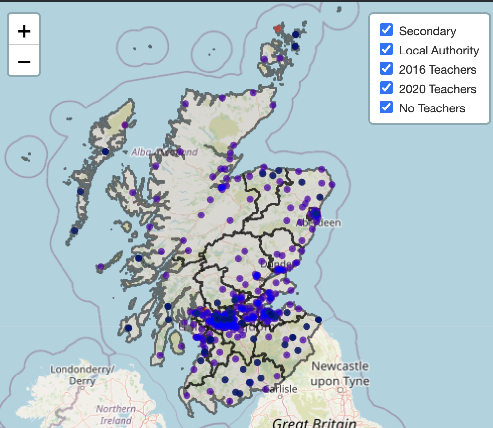

# CTC27_CodeMaps

This project was created over the CTC27 hack weekend (10-11 Sep 2022) to create a map to help visualise what, where and how Computing Science is provisioned and available to young persons in Scotland. 

We created a map which plots the locations of secondary schools in scotland, overlaid with supporting information such as: local authority boundaries, whether there were Computing Science teachers at those schools in 2016 and 2020, and if there were coding clubs in the area.

The data is obtained from several sources and the map is built in R and deployed in an R Shiny app viewable at [https://codethecity.shinyapps.io/CodeMaps/](https://codethecity.shinyapps.io/CodeMaps/)



# Data Sources

## Local Authority Overlays
Scotland Local Authority geojson polygons used in map overlays [github.com/martinjc](https://github.com/martinjc/UK-GeoJSON/blob/master/json/administrative/sco/lad.json)

## Scotland Secondary School Coordinates
This data was extracted from Open Street maps using an [overpass query](https://overpass-turbo.eu/s/1lNy) with output saved to [Data/secondaryschoolsloc.geojson](Data/secondaryschoolsloc.geojson)
```
[out:json][timeout:25];
{{geocodeArea:Scotland}}->.sco;
(
  nwr["amenity"="school"](area.sco);
);
out body;
>;
out skel qt;
```

## Computing Science Teacher Counts
The counts of teachers providing Computing Science education in secondary schools 2016 and 2020 is extracted from this [tableau dashboard](https://public.tableau.com/app/profile/kiranjoza/viz/CS-Teachers-FOI-Responses-2016-2020/FTEbyLocalAuthority) created from FOI requests made by [Education Scotland](https://education.gov.scot/media/odbi3bw4/computing-science-in-local-authority-secondary-schools-jan-22.pdf) and their research into Computing Science provision in secondary schools.
The extracted data is saved in [Data/FTE by Local Authority_data.csv](Data/FTE%20by%20Local%20Authority_data.csv) and [Data/FTE by School_data.csv](Data/FTE%20by%20School_data.csv)

The data for 'Secondary school teachers counts (with main subject of Computing), withing each local authority area in Scotland in 2021' is extracted in file [Data/Secondary_school_teachers_by_main_subject_local_authority_2021.csv](Data/Secondary_school_teachers_by_main_subject_local_authority_2021). This data was extracted from [Teacher census supplementary statistics](https://www.gov.scot/publications/teacher-census-supplementary-statistics/), ([file, table 8.9 ](https://www.gov.scot/binaries/content/documents/govscot/publications/statistics/2019/07/teacher-census-supplementary-data/documents/teacher-census-supplementary-statistics-2021/teacher-census-supplementary-statistics-2021/govscot%3Adocument/Teacher%2BCensus%2BSupplementary%2BStatistics%2B2021.xlsx)). This data hasn't been plugged in into the map itself yet.

## Code Clubs
Manually scraped from websites and social media at the CTC27 hack event. The outputs are saved in [Data/Code_clubs.csv](Data/Code_clubs.csv)

# Map

The source code for the map is [app.R](app.R), a .html only version is available in [schools.html](schools.html) and a published [RShiny App](https://codethecity.shinyapps.io/CodeMaps/) which also includes supporting data tables.